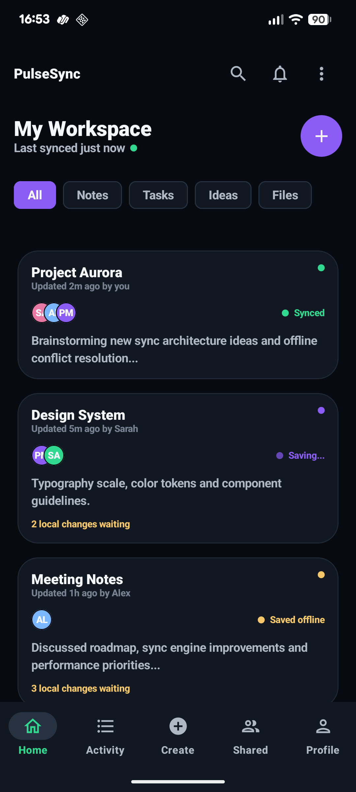
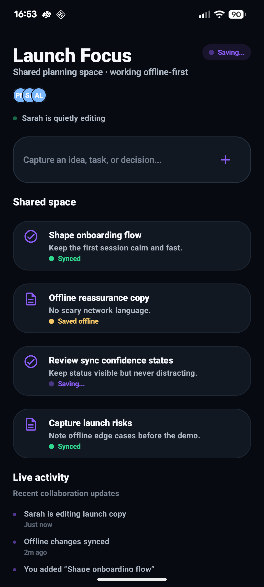
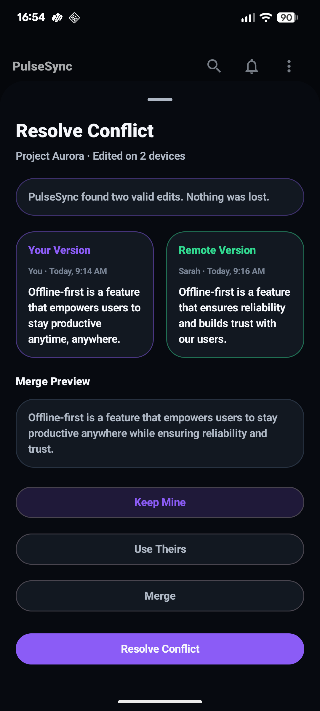
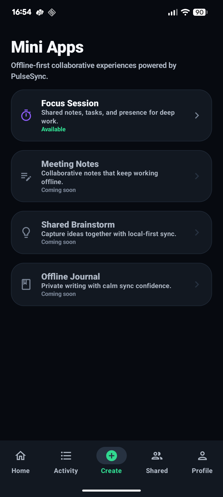
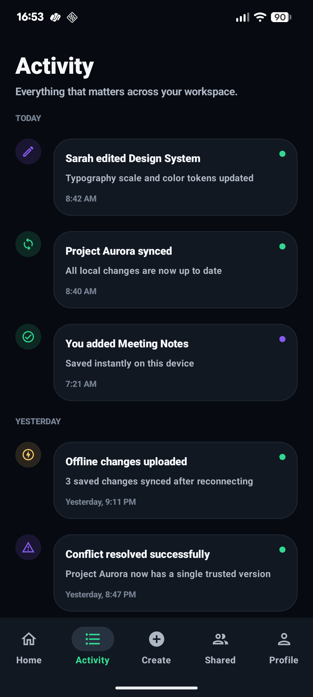
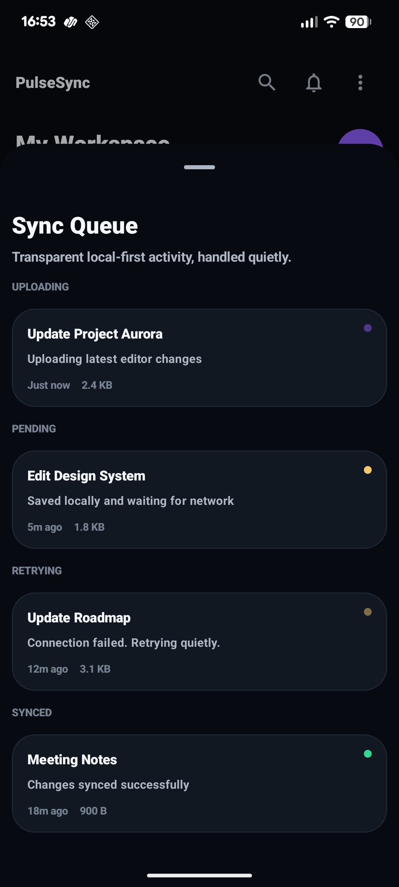
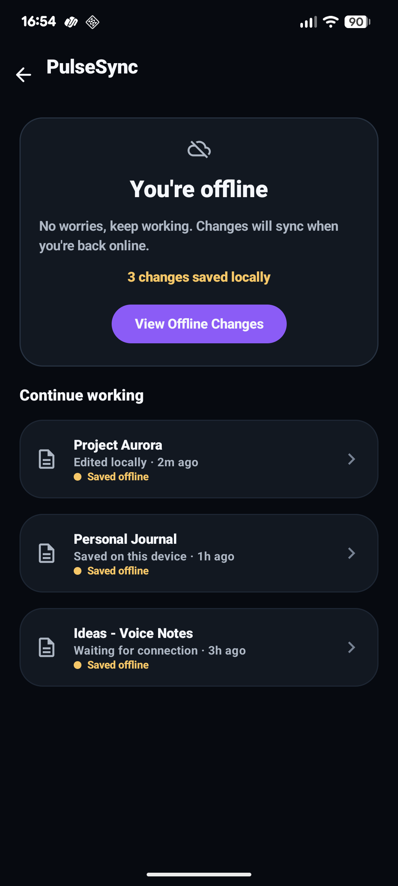

# PulseSync

PulseSync is a premium offline-first collaborative Android experience built for unreliable mobile networks.

It explores a simple product idea: sophisticated synchronization systems should not make users think about synchronization. They should make collaboration feel calm, instant, and trustworthy, even when connectivity is unstable.

PulseSync is not a CRUD sample and it is no longer presented as an infrastructure dashboard. It is a modern collaborative workspace powered by serious mobile systems engineering underneath.

## Highlights

- Offline-first collaborative editing
- Optimistic local persistence
- Calm synchronization UX
- Elegant conflict resolution
- Realtime collaboration activity
- Mini app platform architecture

## Why PulseSync Exists

Over years of building realtime Android systems across unstable mobile environments, I noticed the same problem repeatedly:

Most mobile apps psychologically break the moment connectivity becomes unreliable.

Users lose confidence when they encounter:

- blocking spinners
- failed retries
- disappearing edits
- confusing sync states
- aggressive error messaging

The technical issue is often temporary. The emotional trust damage happens instantly.

PulseSync explores a different direction:

> What would a collaborative mobile product feel like if synchronization became emotionally invisible?

The result is a product experience where edits feel instant, offline work feels safe, conflicts feel understandable, and synchronization stays mostly quiet unless the user needs clarity.

<p align="center">
  
  
  
</p>

## Product Principles

**Calm Synchronization**  
Sync state should reassure, not interrupt. PulseSync uses small indicators, soft labels, and subtle motion instead of blocking loaders or alarming banners.

**Offline Confidence**  
The product should keep working when the network disappears. Local changes remain visible, optimistic, and recoverable.

**Trust Through Transparency**  
Users should not need debug tools, but they should be able to understand what is happening. The sync queue drawer exposes pending, uploading, retrying, and synced changes in calm product language.

**Invisible Infrastructure**  
The synchronization engine is intentionally powerful, but the main experience stays focused on collaboration, editing, and flow.

**Optimistic Interactions**  
User actions apply immediately. Sync follows behind the experience instead of blocking it.

**Realtime Resilience**  
Realtime collaboration should survive mobile uncertainty: slow networks, offline sessions, retries, and version conflicts.

## Product Model

```text
PulseSync Product
├── Workspace Feed
├── Focus Session Mini App
├── Activity Feed
├── Sync Queue
├── Conflict Resolution
└── Offline Experience

Shared Sync Foundation
├── Optimistic updates
├── Offline continuation
├── Retry orchestration
├── Conflict handling
└── Deterministic state reducers
```

## Offline-First Flow

```text
User Action
    ↓
Instant Local Update
    ↓
Optimistic UI Render
    ↓
Background Sync
    ↓
Retry or Conflict Resolution
```

PulseSync keeps collaboration responsive by applying changes locally first, rendering the optimistic state immediately, and handling synchronization quietly in the background. If the network becomes unreliable, the user keeps working while PulseSync retries or asks for a calm resolution only when needed.

## Product Experience

### Workspace Feed

The workspace feed is the first product surface. It presents collaborative documents as calm, premium cards with collaborator avatars, sync confidence, and pending local change hints.

The emotional goal is confidence: users should feel their workspace is alive and protected, not waiting on a network request.

Synchronization supports the feed through subtle status indicators, optimistic card state, and non-blocking loading skeletons.

### Focus Session Mini App

Focus Session is the first PulseSync mini app: a lightweight collaborative workspace for shared tasks, notes, presence, and realtime activity.

It demonstrates how PulseSync can power focused product experiences without exposing infrastructure. Users see collaborators, shared cards, live activity, and calm sync feedback. The sync engine remains mostly invisible.

The emotional goal is flow: a small team can keep working together even when the network is imperfect.

### Activity Feed

The Activity Feed replaces technical timeline logs with human-readable collaboration history.

Instead of operation events, it shows moments:

- Sarah edited Design System
- Project Aurora synced
- Offline changes uploaded
- Conflict resolved successfully

The emotional goal is continuity: users can understand what changed without reading debug output.

### Sync Queue Drawer

The sync queue drawer gives users transparent control without turning the product into a developer tool.

It groups work into calm states:

- Uploading
- Pending
- Retrying
- Synced

The emotional goal is trust: when something is waiting, users can see that PulseSync has it handled.

### Conflict Resolution

Conflict resolution is designed as a premium collaborative decision flow, not an error screen.

PulseSync compares “Your Version” and “Remote Version,” explains that nothing was lost, and offers clear choices:

- Keep Mine
- Use Theirs
- Merge

The emotional goal is control: conflicts become understandable and recoverable instead of scary.

### Offline Experience

The offline experience reassures users that work can continue.

It avoids failure-heavy language and instead communicates:

> You’re offline. No worries, keep working. Changes will sync when you’re back online.

The emotional goal is resilience: the app should feel dependable even when the network is not.

### Developer Diagnostics

PulseSync still preserves deep engineering tooling, but it is intentionally separated from the primary product UX.

Developer diagnostics live behind:

```text
Profile -> Developer Diagnostics
```

This area contains the internal reliability surfaces: network simulation, raw queue inspection, runtime events, observability metrics, and conflict debugging.

The product stays calm. The engineering depth remains available.

## Screenshots & Demos

| Workspace Feed | Mini Apps Launcher | Focus Session |
|---|---|---|
|  |  |  |

| Activity Feed | Sync Queue | Conflict Resolution |
|---|---|---|
|  |  |  |

| Offline Experience |
|---|
|  |

### Demo Preview Placeholders

- Product walkthrough GIF: _coming soon_
- Focus Session interaction demo: _coming soon_
- Offline and sync queue demo: _coming soon_
- Conflict resolution demo: _coming soon_

### Legacy Diagnostics Screens

These screenshots show the internal diagnostics surfaces that now live behind Developer Diagnostics.

| Queue Debug | Network Simulation | Observability |
|---|---|---|
|  |  |  |

| Runtime Events | Conflict Debugging |
|---|---|
|  |  |

## Technical Foundation

PulseSync is built with a modern Android stack and a state-driven architecture designed for offline-first behavior.

Core technologies:

- Kotlin
- Jetpack Compose
- Material 3
- Coroutines and StateFlow
- Navigation Compose
- Hilt
- Reducer-driven state handling
- Optimistic local updates
- Retry orchestration
- Conflict resolution models

The product UI is intentionally separated from synchronization runtime behavior. Screens render immutable state, while sync transitions are modeled through deterministic state reducers and observable runtime flows.

This keeps the experience calm on the surface while preserving reliable synchronization behavior underneath.

## Mini App Platform Direction

PulseSync now supports lightweight collaborative mini apps powered by shared synchronization infrastructure.

The current mini app direction includes:

- Focus Session
- Meeting Notes
- Shared Brainstorm
- Offline Journal

Focus Session is the first implemented sample. It demonstrates how a mini app can use shared product primitives: collaborator presence, optimistic local updates, sync confidence, activity history, and offline-safe interaction patterns.

The long-term direction is a small platform of composable collaboration experiences, all powered by the same local-first synchronization system.

## Engineering Depth

PulseSync keeps serious synchronization engineering underneath the product experience:

- deterministic sync state reduction
- local-first operation modeling
- retry and failure recovery behavior
- conflict detection and resolution flows
- internal diagnostics for runtime inspection

These systems are intentionally secondary in the UX. They support the product without dominating it.

## Testing

Run unit tests:

```bash
./gradlew :app:testDebugUnitTest
```

Build the debug app:

```bash
./gradlew :app:assembleDebug
```

The existing test coverage focuses on deterministic sync behavior, retry policies, runtime orchestration, conflict state mapping, and network-driven outcomes.

## Future Vision

PulseSync is an exploration into trust-preserving mobile collaboration.

The next direction is focused on:

- durable local persistence
- richer offline-first mini apps
- stronger collaboration resilience
- smarter conflict handling
- more realistic realtime sync behavior

The goal is not just to build an offline-first app.

The goal is to study how resilient realtime systems can make mobile software feel calmer, more capable, and more trustworthy.

## Positioning

PulseSync should feel like:

> A beautiful collaborative workspace powered by serious synchronization engineering underneath.
