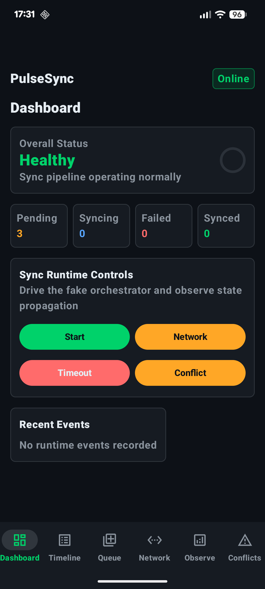
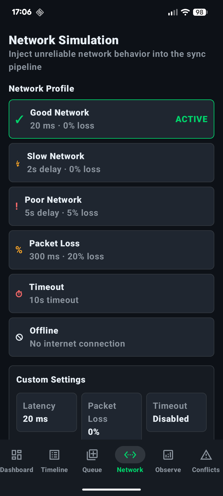
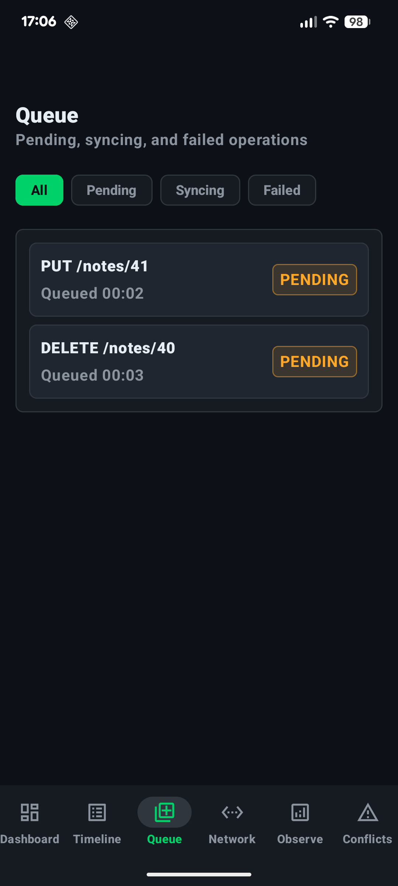
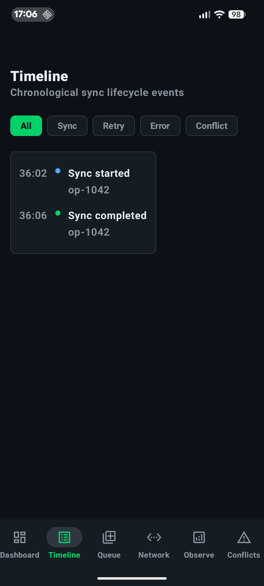
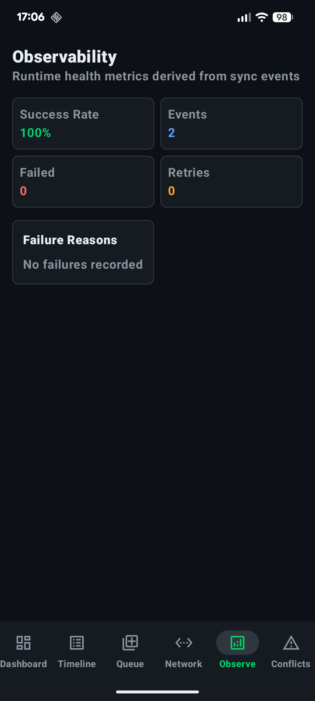
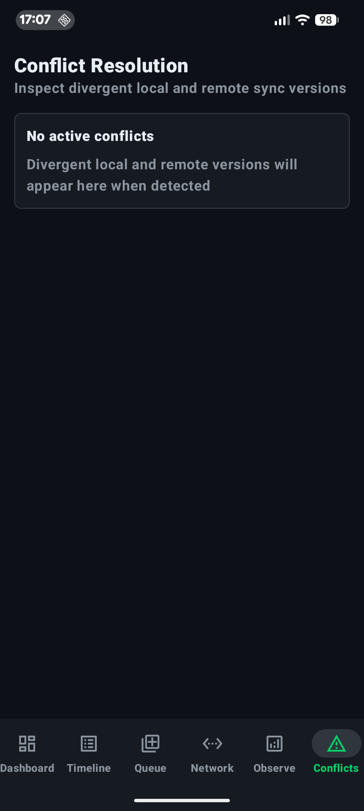

# PulseSync

PulseSync is a production-style Android infrastructure project that simulates offline-first mobile synchronization under unreliable network conditions.

It is not a consumer CRUD app. PulseSync is designed as an internal reliability and observability tool for understanding how sync systems behave across queues, retries, failures, conflicts, and network degradation.

The project is intended to demonstrate senior-level Android architecture, deterministic state management, and systems-thinking around distributed mobile behavior.

## What PulseSync Demonstrates

- Deterministic sync state transitions
- Runtime-backed observability surfaces
- Offline-first synchronization concepts
- Retry and failure recovery modeling
- Conflict detection and resolution flows
- Network condition simulation
- Immutable UI state
- StateFlow-driven presentation
- Modern Android architecture with Jetpack Compose, ViewModels, Navigation Compose, and Hilt

## Screenshots

| Dashboard | Network Simulation | Queue |
|---|---|---|
|  |  |  |

| Timeline | Observability | Conflict Resolution |
|---|---|---|
|  |  |  |

## Architecture Overview

PulseSync is organized around a deterministic runtime pipeline:

```text
SyncOperation
-> SyncStateReducer
-> FakeSyncOrchestrator
-> SyncRuntimeState
-> UI State Mappers
-> ViewModels
-> Compose Screens
```

The sync engine is intentionally pure Kotlin. UI screens do not mutate sync state directly. They render immutable UI state and send user intents upward through callbacks. ViewModels translate those intents into runtime operations through `SyncOrchestrator`.

## Core Layers

### Sync Engine

The sync engine contains pure Kotlin models and deterministic transition logic.

Key types:

- `SyncOperation`
- `SyncOperationStatus`
- `SyncStateReducer`
- `RetryPolicy`
- `SyncFailureReason`
- `SyncAttemptResult`
- `SyncEngineEvent`

The reducer is deterministic: given the same operation, attempt result, retry policy, and timestamp, it produces the same next state and event.

### Runtime

The runtime is a fake in-memory orchestrator that simulates queue processing, retry scheduling, conflict creation, network conditions, and lifecycle events.

Key types:

- `SyncOrchestrator`
- `FakeSyncOrchestrator`
- `SyncRuntimeState`
- `NetworkSimulationRuntimeState`
- `NetworkSyncOutcomePolicy`

The runtime exposes observable state using `StateFlow<SyncRuntimeState>`.

### UI Mapping

Runtime state is transformed into screen-specific immutable UI state through pure mapper functions.

Examples:

- `toDashboardUiState`
- `toTimelineUiState`
- `toQueueUiState`
- `toObservabilityUiState`
- `toConflictUiState`
- `toNetworkSimulationUiState`

This keeps Compose screens focused on rendering and avoids leaking runtime/domain models directly into UI layout logic.

### Presentation

Compose screens render immutable UI state and expose event callbacks. ViewModels collect runtime state, apply mapper functions, and delegate user intents to `SyncOrchestrator`.

The presentation layer uses:

- Jetpack Compose
- Material 3
- Navigation Compose
- Lifecycle-aware state collection
- Hilt-injected ViewModels

## Screens

### Dashboard

The Dashboard displays sync health, queue metrics, recent runtime events, and internal runtime controls.

The runtime controls are intentionally exposed as internal tooling. They allow the user to start the next queued operation and apply the selected network profile to complete the active operation.

### Timeline

Timeline shows chronological sync lifecycle events, including:

- operation started
- operation synced
- operation failed
- retry scheduled

Timeline filters allow viewing sync, retry, error, and conflict-related events.

### Queue

Queue displays pending, syncing, and failed operations. It includes an operation inspector that exposes debugging metadata such as operation id, method, resource path, status, attempt count, and retry timing.

### Network Simulation

Network Simulation allows selecting runtime network conditions such as:

- Good Network
- Slow Network
- Poor Network
- Packet Loss
- Timeout
- Offline

The selected profile is stored in runtime state and can influence sync completion behavior.

### Observability

Observability derives operational metrics from runtime events, including:

- success rate
- total events
- failure count
- retry count
- failure reasons

This screen represents the reliability-monitoring side of PulseSync.

### Conflict Resolution

Conflict Resolution displays active sync conflicts, compares local and remote versions, and supports resolution strategies:

- Local Wins
- Remote Wins
- Merge
- Manual Review

Conflict resolution is backed by deterministic conflict models and runtime state.

## Demo Flow

A useful demo path:

1. Open Network Simulation.
2. Select `Timeout` or `Offline`.
3. Open Dashboard.
4. Tap `Start` to move the next queued operation into flight.
5. Tap `Network` to complete the active operation using the selected network profile.
6. Open Queue to inspect the failed operation.
7. Open Timeline to view failure and retry events.
8. Open Observability to see failure metrics update.

This demonstrates the full runtime path:

```text
Network Profile
-> Sync Runtime
-> State Transition
-> Runtime Events
-> UI Mappers
-> ViewModels
-> Multiple Screens Update
```

## Tech Stack

- Kotlin
- Jetpack Compose
- Material 3
- Coroutines
- StateFlow
- Navigation Compose
- Lifecycle-aware Compose state collection
- Hilt dependency injection
- JUnit unit tests

Room and WorkManager are intentionally deferred. They become relevant when persistence and background execution are introduced.

## Design Direction

PulseSync uses a dark operational interface inspired by internal engineering tools such as Grafana, Datadog, and Android Studio Profiler.

The UI favors:

- dark graphite surfaces
- restrained elevation
- operational green accents
- warning and error semantic colors
- dense debugging-oriented layouts
- state-first rendering

The goal is operational clarity under failure, not consumer-style polish.

## Testing

The project includes unit tests for:

- retry policy behavior
- deterministic sync state transitions
- fake runtime orchestration
- conflict resolution
- runtime-to-UI state mapping
- network-profile-driven sync outcomes

Run tests with:

```bash
./gradlew :app:testDebugUnitTest
```

Build the debug app with:

```bash
./gradlew :app:assembleDebug
```

## Project Status

PulseSync currently includes a fake in-memory runtime rather than persistent storage or background scheduling.

Current capabilities:

- deterministic sync operation lifecycle
- retry scheduling
- runtime-backed Dashboard, Timeline, Queue, Network Simulation, Observability, and Conflict Resolution screens
- network-profile-driven sync results
- conflict creation and resolution flow
- Hilt-backed runtime injection

Planned future phases may include:

- Room-backed durable operation queue
- WorkManager-backed background sync execution
- richer observability charts
- persisted simulation profiles
- operation detail history
- more realistic packet loss and latency simulation

  ## Roadmap

PulseSync v1 focuses on deterministic sync behavior, runtime observability, and internal tooling screens using an in-memory fake runtime.

Future architecture phases:

- Extract the pure sync engine into a standalone `:core:sync` module
- Split runtime orchestration into dedicated runtime/data modules
- Add Room-backed durable operation, event, and conflict storage
- Add WorkManager-backed background sync execution
- Add CI verification with unit tests and debug builds
- Add static analysis with ktlint or detekt
- Expand observability with richer charts and latency metrics
- Add more realistic packet loss and latency simulation

## Portfolio Intent

PulseSync is built to communicate Android architecture and reliability engineering judgment.

The focus is not on implementing a consumer feature set. The focus is on showing how a mobile sync system can be modeled, observed, debugged, and evolved with deterministic state transitions and production-oriented boundaries.
